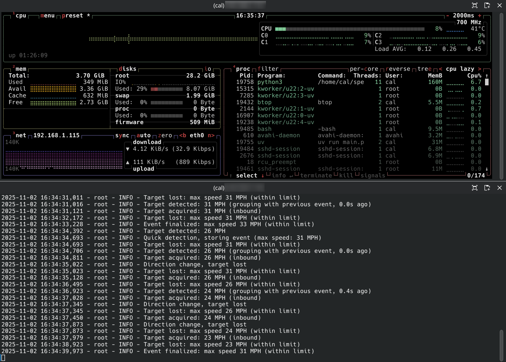

# RushRoster Field Device

> **IoT Speed Monitoring System** | Raspberry Pi + Radar + Computer Vision

## The Origin Story

My neighborhood has a dangerous road with no crosswalk, despite kids needing to cross it daily to get to school. Local authorities were skeptical about the speeding problem, so I decided to build a system to collect data and prove it. The result is RushRoster—a full-featured IoT platform that demonstrates how multiple sensors and AI can work together to solve real-world problems.

This field device is the core of the RushRoster speed monitoring system. It runs on a Raspberry Pi with a radar sensor and camera to detect and photograph speeding vehicles. The device works standalone or can connect to RushRoster Cloud for centralized data management across multiple devices.

## Features

- 🎯 **Real-time Speed Detection**: Radar sensor integration for speed measurement
- 📸 **AI-Powered Photo Selection**: AI analyzes a series of photos and selects the best one for clear, frame-optimized evidence
- 🔋 **Standalone Operation**: Functions independently without cloud connectivity; syncs when available
- 🌐 **REST API**: Complete diagnostic and control API for device management
- 📱 **Web Dashboard**: Real-time status, metrics, and configuration management
- ☁️ **Cloud Integration**: Background sync service for multi-device centralized management

## Technology Stack

- **Runtime**: Python 3.11+ with UV package manager
- **Web Framework**: FastAPI + Uvicorn
- **Database**: SQLite3 with SQLAlchemy ORM
- **Hardware Interface**: PySerial (radar), OpenCV (camera), Supervision (object detection)
- **Frontend**: Vanilla HTML/CSS/JavaScript with server-sent events (SSE) for real-time updates
- **Config**: YAML-based configuration management

## Hardware Requirements

- **Raspberry Pi 4** running Raspbian Linux (Bookworm or later)
- **Network connectivity** Ethernet or WiFi - I used PoE
- **OPS243-A Radar Sensor**: https://omnipresense.com/product/ops243-doppler-radar-sensor/
- **USB Webcam**: for good photos get something at least 4 megapixels with zoom (I use https://www.aliexpress.us/item/3256808555869000.html )
- **SD card**: At least 16GB storage (32GB+ recommended)

## Software Components

- **Radar Sensor Module**: Interfaces with OPS24x radar for speed detection
- **Camera Module**: Continuous capture and synchronized photo capture with YOLOv4-tiny vehicle detection
- **Detection Module**: State machine for vehicle tracking and event recording with intelligent frame filtering
- **SQLite Database**: Local storage for events and metadata
- **FastAPI**: REST API for device status and configuration
- **Web Dashboard**: Simple diagnostic interface
- **Sync Service**: Background service for uploading data to cloud 


## Quick Start

```bash
# 1. Install UV package manager
curl -LsSf https://astral.sh/uv/install.sh | sh

# 2. Clone and navigate
git clone https://github.com/yourusername/rush-roster.git
cd rush-roster/field

# 3. Install dependencies
uv sync

# 4. Configure
cp config.yaml.example config.yaml
# Edit config.yaml with your device settings

# 5. Run
uv run main.py

# 6. Access dashboard
# Open http://localhost:8000 in your browser
```

## Dashboard

Access the web dashboard at **http://localhost:8000**

**Real-time Monitoring:**
- Live camera feed with HUD overlay
- Current speed readings (5 updates/sec via SSE)
- Device health indicators (radar, camera, network)
- Storage usage and upload queue status
- 24-hour statistics (total vehicles, speeders, average/max speed)
- Configuration viewer and quick actions

### Dashboard Preview


*RushRoster Field Device Dashboard with live speed readings, camera feed, and system statistics*

### Video Demo

<video src="example_media/example.mp4" width="100%" controls></video>

*Real-time dashboard demonstration showing live monitoring and event detection*

### Lightweight System Performance


*RushRoster Field Device running efficiently on Raspberry Pi - minimal CPU and memory footprint using btop monitor*

## API Endpoints

- `GET /health` - Health check
- `GET /status` - Device status and sensor info
- `GET /stats` - Statistics (vehicles, speeders, speeds)
- `GET /events` - Recent detected events
- `GET /config` - Current device configuration
- `PUT /config` - Update configuration
- `POST /sync` - Trigger manual cloud sync
- `GET /camera/frame` - Current camera frame with HUD
- `GET /sensors/stream` - Real-time sensor data (Server-Sent Events)

Full API docs available at `/docs` (Swagger) and `/redoc` (ReDoc)

## Directory Structure

```
field/
├── main.py                 # Main entry point
├── config.yaml             # Configuration file (don't commit)
├── pyproject.toml         # Project metadata and dependencies
├── uv.lock                # Locked dependency versions
├── data/                  # Database files
├── photos/                # Captured photos
├── rush-roster.log        # Log file
└── src/
    ├── sensors/           # Radar and camera modules
    ├── detection/         # Detection and tracking logic
    ├── database/          # SQLite database manager
    ├── api/              # FastAPI diagnostic API
    ├── upload/           # Cloud sync service
    ├── ui/               # Web dashboard templates
    └── config.py         # Configuration management
```

## Logging

Logs are written to console and `rush-roster.log`. Adjust log level in `main.py` if needed.

## Troubleshooting

### Camera not found
```bash
ls /dev/video*  # Check available cameras
```
Update `camera.device` in config.yaml to match the correct device path.

### Radar not detected
```bash
ls /dev/ttyACM*  # Check USB serial devices
```
Update `radar.port` in config.yaml. Also ensure user has serial permissions:
```bash
sudo usermod -a -G dialout $USER
# Log out and back in for changes to take effect
```

### API won't start or port in use
Check if port 8000 is already in use:
```bash
lsof -i :8000
```
Change port in config.yaml or kill the conflicting process.

### See full logs
Logs are written to `rush-roster.log` and console. Check recent entries:
```bash
tail -f rush-roster.log
```

